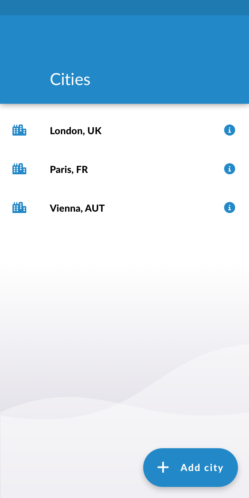

# Weather app using React Native (expo)
design available in ReactNative assement folder
Weather app fetches real-time data for current weather for countries using openweathermap api

## Home Screen

## Search Modal

## City Details Screen

